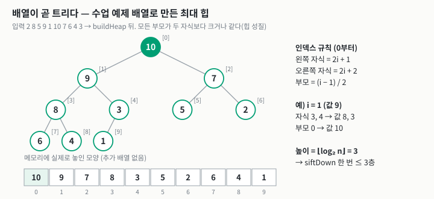
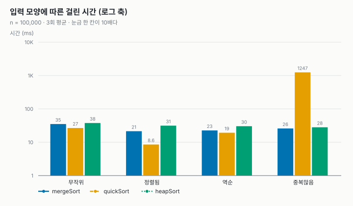
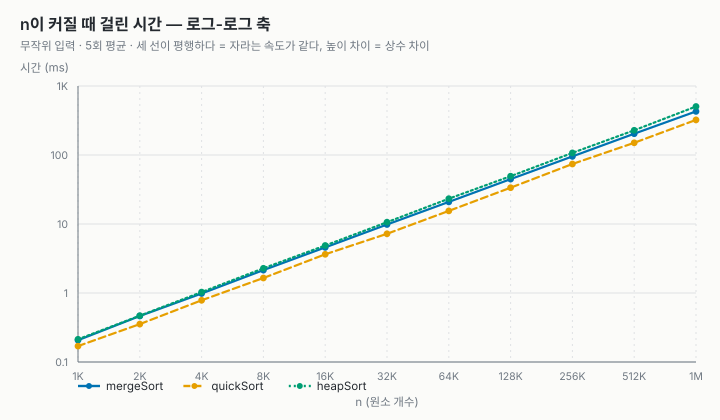
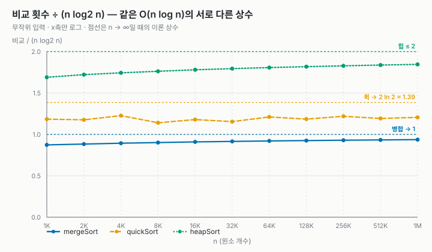
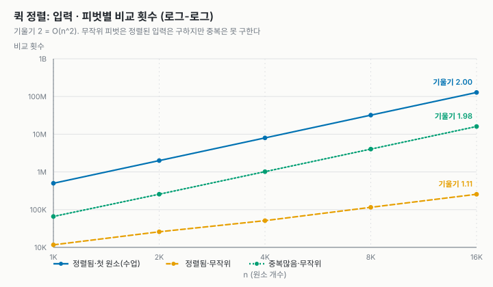

# 과제 1 정렬 비교 보고서 (병합 정렬 / 퀵 정렬 / 힙 정렬)

- 과목: 고급알고리즘 (SIT2001-01)
- 학번 / 이름: 2026193225 / 김도윤
- GitHub: https://github.com/[계정]/[저장소]
- AI 활용: 힙 정렬 학습(부록), 코드 작성과 보고서 정리에 Claude를 사용함

## 1. 비교한 정렬

| | 병합 정렬 | 퀵 정렬 | 힙 정렬 |
| --- | --- | --- | --- |
| 수업에서 | 배움 | 배움 | 안 배움 |
| 평균 / 최악 시간 | n log n / n log n | n log n / n² | n log n / n log n |
| 추가 메모리 | O(n) | O(log n) (재귀 스택) | O(1) |
| 안정 정렬 | O | X | X |

세 개 다 평균은 O(n log n)인데 하나씩 약점이 다르다. 병합은 메모리를 n만큼 더 쓰고, 퀵은 최악이 n²이고,
힙은 최악도 n log n이고 메모리도 안 쓰지만 안정 정렬이 아니다. 그래서 이 셋을 같이 비교하면 차이가 잘
보일 것 같아서 골랐다. 힙 정렬은 위키피디아 비교표[1]에서 최악 n log n이면서 메모리가 O(1)인 정렬 중에
제일 이해하기 쉬워 보여서 골랐다.

## 2. 구현

### 2.1 구조

교수님 샘플처럼 정렬마다 구조체 하나를 만들고 함수 포인터로 부르게 했다. 이렇게 하면 main이나 테스트에서
정렬 이름을 따로 안 쓰고 배열(`SORT_ALGORITHMS`)만 돌면 된다.

```c
typedef struct SortAlgorithm {
    const char *name;
    const char *timeComplexity;
    const char *spaceComplexity;
    int stable;
    void (*sort)(void *base, size_t n, size_t size, SortCompare cmp, SortStats *stats);
} SortAlgorithm;
```

원소는 `(key, tag)` 두 개짜리 구조체(8바이트)를 썼다. key로 정렬하고 tag에는 원래 순서를 넣어 둬서,
정렬 후에 같은 key끼리 tag 순서가 유지됐는지 보면 안정 정렬인지 확인할 수 있다.

| 파일 | 내용 |
| --- | --- |
| `src/mergeSort.c`, `quickSort.c`, `heapSort.c` | 정렬 3개 |
| `src/sort.c`, `sortctx.h` | 비교/이동 세는 공통 함수, 정렬 목록 |
| `src/bench.c` | 입력 만들기, 시간 재기, 안정성 확인 |
| `src/main.c` | 결과 출력 (`--csv`, `--pivot`, `--theory`, `--big` 옵션) |
| `tests/test_sort.c` | 테스트 55개 |
| `tools/plot.py` | csv로 그래프 그리기 (`svgchart.py`는 샘플 것을 가져와서 조금 고침) |

입력용 난수는 `rand()` 대신 수업 topic-04에 나온 minstd(곱하기 16807)를 썼다. 그래서 어느 컴퓨터에서 돌려도
비교 횟수, 이동 횟수는 똑같이 나온다.

### 2.2 수업 코드랑 같은지 확인

병합이랑 퀵은 수업 코드(algorithm-code)를 그대로 옮기고 타입만 `void *`로 바꿨다. 제대로 옮겼는지 보려고
수업 예제 배열 `2 8 5 9 1 10 7 6 4 3`으로 돌려서 README에 있는 숫자랑 비교했다.

| | 수업 README | 내 코드 |
| --- | --- | --- |
| 병합 정렬 (비교 / 이동) | 22 / 68 | 22 / 68 |
| 퀵 정렬, 첫 원소 피벗 (비교 / 이동) | 25 / 21 | 25 / 21 |
| 힙 정렬 (비교 / 이동) | 없음 | 40 / 81 |

퀵 정렬은 수업 README에서 피벗을 랜덤으로 고르면 정렬된 입력 문제가 없어진다고 해서 기본값을 랜덤 피벗으로
했다. 랜덤으로 고른 원소를 맨 앞이랑 바꾼 다음 나머지는 수업 코드랑 똑같다. 4.3에서 첫 원소 피벗이랑 비교했다.

### 2.3 테스트

`make test` 결과 55개 전부 통과했다. 정렬 3개에 대해 같은 테스트를 돌린다.

- 섞인 배열, 정렬된 배열, 역순, 중복, 전부 같은 값, 원소 0/1/2개, INT_MIN/INT_MAX
- n = 0부터 300까지 전부 `qsort` 결과랑 비교
- 안정성: 실제로 재 본 결과가 표에 적은 `stable` 값이랑 같은지
- 첫 원소 피벗 + 정렬된 입력이면 비교가 n(n-1)/2, 재귀 깊이가 n인지

테스트가 진짜 잡는지 보려고 코드를 일부러 틀리게 바꿔 봤다. 병합의 `<=`를 `<`로 바꾸면 안정성 테스트가
실패했고, 힙에서 오른쪽 자식 비교를 지우면 9개가 실패했다. 퀵의 `<`를 `<=`로 바꿨을 때는 하나도 실패하지
않았는데, 확인해 보니 이건 같은 값을 왼쪽으로 보내는 것뿐이라 정렬 결과는 맞는 거였다.
`make asan`(AddressSanitizer)으로도 돌려서 메모리 오류가 없는 것을 확인했다.

## 3. 힙 정렬 (새로 공부한 정렬)

### 3.1 아이디어

선택 정렬은 남은 것 중에서 최댓값을 찾아서 뒤로 보내는 걸 반복하는데, 최댓값 찾는 데 매번 O(n)이 걸려서
전체가 O(n²)이다. 힙 정렬은 원소를 최대 힙(부모가 자식보다 항상 크거나 같은 완전 이진 트리)으로 만들어 두고
최댓값을 O(log n)에 다시 찾는다.

완전 이진 트리는 빈칸 없이 왼쪽부터 채워지니까 배열에 그냥 순서대로 넣을 수 있다. 0번부터 세면

$$\text{왼쪽 자식} = 2i+1, \quad \text{오른쪽 자식} = 2i+2, \quad \text{부모} = \lfloor (i-1)/2 \rfloor$$

이라서 포인터나 추가 배열이 필요 없다. 그래서 추가 메모리가 O(1)이다.



### 3.2 과정

1. 힙 만들기: 마지막 부모(n/2 - 1번)부터 0번까지 거꾸로 가면서 `siftDown`을 한다.
2. 정렬: `a[0]`(최댓값)을 힙의 마지막 원소랑 바꾸고, 힙 크기를 1 줄인 다음 `a[0]`을 `siftDown`한다. 이걸 n-1번 반복한다.

`siftDown`은 두 자식 중 큰 쪽과 비교해서 자식이 더 크면 바꾸고 내려가는 것이다.

```c
static void siftDown(SortCtx *c, size_t i, size_t n) {
    while (1) {
        size_t child = 2 * i + 1;
        if (child >= n) return;
        if (child + 1 < n && sortCompareAt(c, child + 1, child) > 0) child++;
        if (sortCompareAt(c, child, i) <= 0) return;
        sortSwap(c, i, child);
        i = child;
    }
}
```

수업 예제 배열로 해 보면 힙을 만든 뒤 `10 9 7 8 3 5 2 6 4 1`이 되고, 그다음부터 10, 9, 8, ... 순서로 뒤에
하나씩 자리 잡는다.

| 단계 | 힙 부분 | 정렬 끝난 부분 |
| --- | --- | --- |
| 힙 만든 직후 | 10 9 7 8 3 5 2 6 4 1 | |
| 1번째 | 9 8 7 6 3 5 2 1 4 | 10 |
| 2번째 | 8 6 7 4 3 5 2 1 | 9 10 |
| 3번째 | 7 6 5 4 3 1 2 | 8 9 10 |

### 3.3 시간 복잡도

정렬 단계: 트리 높이가 $\lfloor \log_2 n \rfloor$이고 한 층 내려갈 때 비교가 2번(자식 둘 비교, 자식이랑 나 비교)이라서
siftDown 한 번에 최대 $2\log_2 n$번 비교한다. 이걸 n-1번 하니까

$$C_{\text{정렬}} \le 2n\log_2 n$$

힙 만들기: 그냥 생각하면 n개를 log n씩 내리니까 n log n 같은데 실제로는 O(n)이다. 높이가 h인 노드는 대략
$n/2^{h+1}$개이고 각각 최대 h층만 내려가니까

$$C_{\text{힙 만들기}} \approx \sum_{h=0}^{\lfloor \log_2 n \rfloor} \frac{n}{2^{h+1}} \cdot 2h \le n\sum_{h \ge 0} \frac{h}{2^h}$$

인데 $\sum_{h\ge0} h x^h = \dfrac{x}{(1-x)^2}$에 $x = 1/2$을 넣으면 2가 나와서 대략 $2n$ 이하, 즉 O(n)이다.
대부분의 노드가 아래쪽에 있어서 조금만 내려가기 때문이다. (수업 예제로 세어 보면 힙 만들기 비교가 13번이었고 2n = 20보다 작다.)

### 3.4 안정 정렬이 아닌 이유

`a[0]`이랑 맨 끝을 바꿀 때 원소가 멀리 이동해서 같은 key끼리 순서가 바뀔 수 있다. 4.4에서 실제로 확인했다.

## 4. 실험

실험 조건:
- 입력 4종류: 무작위, 정렬됨, 역순, 중복많음(key가 0~7 8가지뿐)
- 비교 횟수, 이동 횟수(swap 1번 = 3), 추가 메모리, 최대 재귀 깊이, 시간(`clock()`, 3~5번 평균)
- 시간은 컴퓨터마다 다르니까 비교/이동 횟수를 같이 봤다. 측정한 컴퓨터는 Linux, Intel Xeon 2.1GHz, gcc 13.3 `-O2`
- 표와 그래프는 `make charts` 한 번 돌린 결과이고, 원본은 `report/*.csv`에 있다.

### 4.1 입력 모양별 (n = 100,000)

| 입력 | 정렬 | 시간(ms) | 비교 | 이동 | 재귀 깊이 |
| --- | --- | ---: | ---: | ---: | ---: |
| 무작위 | merge | 35.1 | 1,536,461 | 3,337,856 | 18 |
| 무작위 | quick | 26.7 | 2,013,228 | 3,210,306 | 41 |
| 무작위 | heap | 37.7 | 3,019,269 | 4,724,832 | 1 |
| 정렬됨 | merge | 21.4 | 853,904 | 3,337,856 | 18 |
| 정렬됨 | quick | 8.6 | 1,967,664 | 300,366 | 37 |
| 정렬됨 | heap | 31.4 | 3,112,517 | 4,952,562 | 1 |
| 역순 | merge | 22.6 | 815,024 | 3,337,856 | 18 |
| 역순 | quick | 19.3 | 1,948,244 | 2,341,506 | 45 |
| 역순 | heap | 30.3 | 2,926,640 | 4,492,302 | 1 |
| 중복많음 | merge | 25.9 | 1,468,546 | 3,337,856 | 18 |
| 중복많음 | quick | 1,247.4 | 625,280,503 | 787,008 | 12,598 |
| 중복많음 | heap | 28.1 | 2,691,254 | 4,131,927 | 1 |



- 무작위, 정렬됨, 역순에서는 퀵 정렬이 제일 빨랐다.
- 그런데 중복많음에서는 퀵 정렬이 1.2초로 다른 둘보다 44~48배 느렸다. 이유는 파티션에서 `a[j] < pivot`인
  것만 왼쪽으로 보내기 때문이다. 같은 값이 m개 모여 있으면 피벗보다 작은 게 없어서 한 번에 하나씩만 줄어들고,
  그 부분에서 비교가 $m(m-1)/2$번 생긴다. key별 개수(12,374~12,594개)를 실제로 세서 더해 보니
  $\sum m(m-1)/2 = 624{,}980{,}943$이었고, 측정값 625,280,503이랑 0.05% 차이였다. 재귀 깊이 12,598도
  제일 많은 key 개수 12,594랑 거의 같다.
- 힙 정렬은 입력이 달라도 28~38ms로 별로 차이가 없었다. 입력이 뭐든 힙 만들고 줄이는 과정은 같아서 그런 것 같다.
- 병합 정렬은 이동 횟수가 입력에 상관없이 3,337,856으로 똑같았다. temp로 복사했다가 다시 가져오는 걸 항상
  하기 때문이다. 비교는 정렬됨/역순에서 거의 반으로 줄었는데, 한쪽이 먼저 끝나면 나머지는 비교 없이 복사하기 때문이다.

### 4.2 n을 두 배씩 늘리기 (무작위 입력)

수업 topic-05에서 한 배가 실험처럼 n을 1,000부터 1,024,000까지 두 배씩 늘려 봤다.



| | n 두 배일 때 시간 배율 | n = 1,024,000 시간 |
| --- | --- | ---: |
| merge | 2.11 ~ 2.24 | 428.7 ms |
| quick | 1.98 ~ 2.21 | 322.1 ms |
| heap | 2.12 ~ 2.22 | 505.2 ms |

O(n²)이면 4배가 돼야 하는데 셋 다 2배 조금 넘게 나왔다. n log n도 n이 두 배면 2.1~2.2배 정도라서 맞는다.
로그-로그 그래프 기울기도 1.09~1.12였는데, 같은 범위에서 n log n의 기울기를 계산하면 1.10이다.

세 개 다 n log n인데 왜 시간이 다른지 보려고 비교 횟수를 $n\log_2 n$으로 나눠 봤다.



이론값이랑 비교하기 위해 시드 10개로 평균을 냈다 (`--theory`, n = 2의 거듭제곱).

- 병합: $n\log_2 n - 1.2645n$ [3]
- 퀵: $2(n+1)H_n - 4n$ ($H_n \approx \ln n + 0.5772$) [4]. $\ln n = \ln 2 \cdot \log_2 n$이라서 $2n\ln n \approx 1.386\, n\log_2 n$이 된다.
- 힙: 3.3에서 구한 상한 $2n\log_2 n$

| n | 병합 실측 / 이론 | 퀵 실측 / 이론 | 힙 실측 / 상한 |
| ---: | ---: | ---: | ---: |
| 1,024 | 8,952.5 / 8,945.2 | 11,316.8 / 11,297.8 | 17,322.6 / 20,480 |
| 8,192 | 96,174.4 / 96,137.2 | 123,088.6 / 124,344.1 | 187,680.7 / 212,992 |
| 65,536 | 965,655.6 / 965,705.7 | 1,266,605.6 / 1,267,172.1 | 1,894,666.8 / 2,097,152 |
| 1,048,576 | 19,645,619.0 / 19,645,595.6 | 26,176,660.2 / 26,088,934.8 | 38,705,568.4 / 41,943,040 |

- 병합은 오차가 0.1%도 안 됐다.
- 퀵은 평균은 1% 안으로 맞았는데 한 번씩은 많이 흔들렸다 (n = 1,024에서 10번 중 최소 10,377, 최대 12,115).
  랜덤 피벗이라서 그런 것 같다.
- 힙은 상한보다 항상 약 3.09n 정도 적게 나왔다. 그래서 n이 커질수록 2에 가까워진다.
- 결국 셋 다 n log n이지만 앞에 붙는 숫자가 약 1, 1.39, 2로 달라서 시간 차이가 나는 것이다.

### 4.3 퀵 정렬 피벗 실험 (`--pivot`)



| n = 16,000 | 첫 원소 피벗 (수업 코드) | 랜덤 피벗 |
| --- | ---: | ---: |
| 무작위 입력 (비교 / 재귀 깊이) | 251,966 / 33 | 263,416 / 31 |
| 정렬된 입력 | 127,992,000 / 16,000 | 255,240 / 31 |
| 중복많음 | 16,061,968 / 2,050 | 16,050,049 / 2,051 |

- 정렬된 입력 + 첫 원소 피벗은 비교가 16000 × 15999 / 2 = 127,992,000으로 정확히 최악이었다. 재귀 깊이도 n이다.
- 랜덤 피벗으로 바꾸니까 약 500배 줄었다.
- 하지만 중복많음은 랜덤 피벗이어도 그대로였다 (그래프 기울기 1.98). 피벗을 뭘 고르든 같은 값은 전부 한쪽으로
  가기 때문이다. 찾아보니 피벗보다 작은 것/같은 것/큰 것 셋으로 나누는 3-way 파티션을 쓰면 해결된다고 한다[4].
  이번에는 구현하지 못했다.

### 4.4 메모리, 재귀 깊이, 안정성

| | 추가 메모리 (n = 100,000) | 재귀 깊이 | 안정성 (중복많음에서 확인) |
| --- | ---: | ---: | --- |
| merge | 800,008 B | 18 | 안정 |
| quick | 8 B | 37 ~ 45 | 불안정 |
| heap | 8 B | 1 | 불안정 |

- 8 B는 swap할 때 쓰는 원소 한 칸이다. 병합만 temp 배열 때문에 8n + 8바이트를 쓴다.
- 힙 정렬은 반복문만 써서 재귀 깊이가 1이다.
- 무작위 입력에서는 key가 거의 안 겹쳐서 셋 다 안정으로 나온다. 그래서 안정성은 중복많음 입력으로 확인했다.

### 4.5 큰 n (`--big`, 1번씩 측정)

위키피디아에 힙 정렬은 메모리 접근이 흩어져 있어서(locality가 나빠서) 실제로는 퀵 정렬보다 느리다고 나와
있어서[2] 확인해 봤다. 배열을 캐시(L2 4MB)보다 훨씬 크게 늘리면서 비교 1번당 걸린 시간을 계산했다.

| n | merge (ns/비교) | quick (ns/비교) | heap (ns/비교) | heap 시간 / quick 시간 |
| ---: | ---: | ---: | ---: | ---: |
| 1,000,000 | 22.21 | 12.50 | 13.16 | 1.57 |
| 4,000,000 | 21.95 | 12.69 | 14.99 | 1.81 |
| 16,000,000 | 22.16 | 12.70 | 17.77 | 2.05 |

병합이랑 퀵은 거의 그대로인데 힙만 13.16에서 17.77로 35% 늘었다. siftDown에서 i에서 2i+1로 점프하니까
배열이 크면 멀리 떨어진 곳을 읽게 돼서 그런 것 같다. (캐시 미스를 직접 잰 건 아니다.)
병합이 비교 1번당 시간이 큰 건 비교 1번마다 이동이 2번 이상 있어서다.

## 5. 결론

- 평균적으로는 퀵 정렬이 제일 빨랐다. 하지만 중복이 많으면 수업 방식 파티션은 n²이 된다.
- 병합 정렬은 셋 중 유일하게 안정 정렬이고 입력에 상관없이 성능이 일정했다. 대신 메모리를 n만큼 더 쓴다.
- 힙 정렬은 메모리를 거의 안 쓰고 최악도 n log n이지만, 비교 횟수가 제일 많고 배열이 클수록 더 느려졌다.
- 복잡도가 똑같이 O(n log n)이어도 앞에 붙는 상수랑 메모리 접근 방식 때문에 실제 속도는 꽤 차이 난다는 걸 알게 됐다.

한계: 퀵 정렬의 중복 문제는 원인만 확인하고 3-way 파티션은 구현하지 않았다. 시간은 한 컴퓨터에서만 쟀다.
힙 정렬은 교과서 방식(swap)으로만 구현했다.

## 부록. 힙 정렬 AI 학습 내용

2026-09-28에 Claude(Anthropic)에게 질문하면서 공부했다. AI 답변은 그대로 쓰지 않고 테스트, 계산, 실험, 위키피디아로 확인했다.

| 질문 | AI 답변 요약 | 확인한 방법 |
| --- | --- | --- |
| 힙 정렬이 뭔가? | 선택 정렬에서 최댓값 찾기를 힙으로 O(log n)에 하는 것. 1964년 Williams가 만들고 같은 해 Floyd가 제자리 정렬 버전을 냄 | 위키피디아 Heapsort[2] |
| 트리를 배열에 어떻게 넣나? | 완전 이진 트리라서 자식 2i+1, 2i+2, 부모 (i-1)/2 | 수업 예제로 직접 그려 봄, n = 0~300 테스트 |
| 힙 만들기가 왜 O(n)인가? | 대부분 노드가 아래쪽이라 조금만 내려감. $\sum h/2^h$가 수렴 | 3.3에서 직접 계산, 예제에서 비교 13번 ≤ 20 |
| 비교 횟수는? | 대략 2n log n, 병합의 2배 정도 | 실험으로 확인 (2n log₂ n - 3.09n) |
| 왜 불안정한가? | 루트랑 끝을 바꿀 때 멀리 이동해서 | 중복많음 입력에서 확인 |
| 최악이 n log n인데 왜 퀵보다 느린가? | 메모리 접근이 흩어져서 캐시를 잘 못 씀 | 4.5에서 n을 키우며 확인 (캐시 미스를 직접 재진 않음) |
| 실제로 어디에 쓰나? | 퀵 정렬이 느려지면 힙 정렬로 바꾸는 introsort | 위키피디아[1] |

"평균 비교 횟수의 정확한 식"은 자료마다 달라서 보고서에서는 상한 $2n\log_2 n$만 이론값으로 쓰고,
3.09n은 실험으로 나온 값이라고 따로 적었다.

## 참고 자료

1. Wikipedia, "Sorting algorithm" (Comparison of algorithms), https://en.wikipedia.org/wiki/Sorting_algorithm
2. Wikipedia, "Heapsort", https://en.wikipedia.org/wiki/Heapsort
3. Wikipedia, "Merge sort", https://en.wikipedia.org/wiki/Merge_sort
4. Wikipedia, "Quicksort", https://en.wikipedia.org/wiki/Quicksort
5. 수업 예제 코드 lec-algorithm/algorithm-code, 과제 샘플 lec-algorithm/hw1-sample-2026
